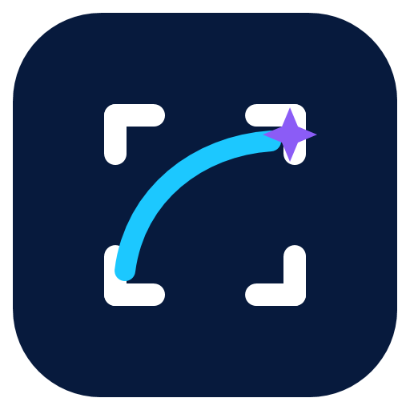

# SnipArc

A fast, local-only Windows screenshot and annotation tool built for low-friction capture, precise selection, immediate markup, and private output.

[](https://github.com/77degrees/SnipArc/actions/workflows/ci.yml)
[](LICENSE)



> Status: working `0.2.0-alpha` for Windows 11 x64. The current installer is unsigned and intended for local testing.

## Install the alpha

Download `SnipArc-Setup-x64.exe` from the
[latest GitHub release](https://github.com/77degrees/SnipArc/releases/latest).
It installs per user under `%LocalAppData%\Programs\ScreenCaptureApp` and does
not require administrator rights. The internal folder and executable names
intentionally remain `ScreenCaptureApp` during the alpha so existing
installations and settings upgrade in place.

Because this alpha is not code-signed, Windows SmartScreen may show an unknown-publisher warning. Do not distribute it as a trusted public release until a signing identity is configured.

## Use it

1. Start **SnipArc** from the Start menu. It stays in the notification area.
2. Press **Print Screen**. If Windows or another app owns that shortcut, choose `Ctrl+Shift+4` or `Ctrl+Shift+S` in Settings. To use the familiar Snipping Tool shortcut, enable **Use Windows + Shift + S for this app instead of Snipping Tool**.
3. Hover over a window and click to select the whole window, or drag to select a custom area.
4. Resize from the eight handles, move the selection, or annotate it.
5. Copy, save, extract text/barcodes, record the area as an animated GIF, or start a multi-page scrolling capture.
6. Press **Esc** to cancel.

The selection supports directional resize cursors, one-pixel arrow-key nudging, ten-pixel `Shift` nudging, live pixel dimensions, undo/redo, and keyboard tool shortcuts shown in each tooltip.

## Implemented features

- Single-instance notification-area application with global hotkey handling and an optional, reversible Windows + Shift + S override.
- Physical-pixel GDI capture with optional mouse pointer composition.
- Active-monitor selection overlay with mixed-DPI-aware positioning.
- Smart whole-window detection with hover preview and click-to-select.
- Pen, line, arrow, rectangle, highlighter, text, pixelation, and opaque redaction.
- Clipboard copy and local PNG, JPG, or BMP saving.
- Manual multi-page scrolling capture with automatic vertical-overlap removal and PNG output.
- Animated GIF recording at 8 FPS for up to 15 seconds, scaled to a maximum 1280-pixel dimension.
- Offline English OCR and multi-format barcode/QR recognition.
- Optional translation through a user-configured HTTPS LibreTranslate-compatible endpoint.
- A Manifest V3 Chromium extension for visible-tab capture, crop, copy, and download.
- Exact-pixel opaque redaction applied last during export.
- Lossless-only export enforcement when a capture contains opaque redaction.
- Configurable shortcuts, capture folder, quick-save format, pointer inclusion, notifications, and startup preference.
- Per-user, self-contained Inno Setup installer and clean uninstall.
- Buildable per-machine MSI plus ADMX/ADML policies for managed Windows deployment.
- No accounts, screenshot uploads, analytics, telemetry, or hidden screenshot history.

## Build from source

Requirements:

- Windows 11 x64
- .NET SDK `10.0.302` or the compatible SDK selected by `global.json`
- Inno Setup 6 only when building the installer

Build and test:

```powershell
dotnet restore ScreenCaptureApp.slnx
dotnet build ScreenCaptureApp.slnx -c Release --no-restore
dotnet test ScreenCaptureApp.slnx -c Release --no-build --no-restore
```

Publish the self-contained app and all distribution packages:

```powershell
.\eng\build-release.ps1 -BuildInstaller -BuildEnterpriseMsi -BuildBrowserExtension
```

Outputs:

- `artifacts/app/win-x64/ScreenCaptureApp.exe` — unpackaged self-contained app.
- `artifacts/installer/SnipArc-Setup-x64.exe` — per-user installer.
- `artifacts/enterprise/SnipArc-Enterprise-x64.msi` — per-machine enterprise installer.
- `artifacts/extension/SnipArc-Browser-Capture-0.2.0.zip` — source-loadable Edge/Chrome extension.
- `artifacts/SHA256SUMS.txt` — hashes for the verified local release artifacts.

## Project layout

| Path | Responsibility |
|---|---|
| `src/ScreenCaptureApp.Core` | Geometry, selection, annotations, editor commands, and history |
| `src/ScreenCaptureApp.Windows` | Capture, displays, hotkeys, clipboard, settings, startup, and single-instance IPC |
| `src/ScreenCaptureApp.App` | WPF tray application, overlay, toolbars, export workflow, and settings UI |
| `tests/` | Core, Windows-infrastructure, and export-safety tests |
| `installer/` | Inno Setup definition and installer notes |
| `packaging/enterprise/` | WiX MSI and Group Policy Administrative Templates |
| `extensions/chromium/` | Edge/Chrome visible-tab capture extension |
| `eng/` | Repeatable release build script |
| `docs/` | Requirements, architecture, privacy, testing, and decisions |
| `plans/` | Original implementation blueprint |

## Current alpha limitations

- Capture and selection are limited to one monitor at a time; cross-monitor selection is planned.
- Windows spanning more than one monitor are not offered for whole-window selection in this alpha.
- HDR, protected content, and exclusive-fullscreen applications may not capture as expected with the initial GDI backend.
- The installer and binaries are not code-signed.
- Upload, cloud galleries, user accounts, and comments remain absent. The alpha never sends captured pixels over the network.
- Translation is optional and sends extracted text—not image pixels—only after the user presses Translate.
- Scrolling capture is user-stepped: the user scrolls between page captures; application-specific automatic scrolling is not yet reliable across browsers and desktop frameworks.
- The Chromium extension is loadable from source but is not published in browser stores.
- Native macOS and Linux desktop clients do not exist yet.
- Automatic updates are not enabled until a public release feed and code-signing identity exist.
- Visual and interaction testing across the full mixed-DPI hardware matrix remains a release gate.

## Documentation

- [Documentation index](docs/README.md)
- [Product requirements](docs/requirements.md)
- [Architecture](docs/architecture.md)
- [Security and privacy](docs/security-and-privacy.md)
- [Code signing](docs/code-signing.md)
- [Testing strategy](docs/testing.md)
- [Decision log](docs/decisions.md)
- [Brand and naming](docs/branding.md)
- [Implementation blueprint](plans/windows-screenshot-tool-blueprint.md)
- [Changelog](CHANGELOG.md)

## Contributing and license

SnipArc is open-source software under the [MIT License](LICENSE).
Contributions are welcome; read [CONTRIBUTING.md](CONTRIBUTING.md) before
opening a pull request. Report suspected vulnerabilities privately according
to [SECURITY.md](SECURITY.md).

## Platform references

Platform and packaging decisions use Microsoft documentation for [.NET support](https://dotnet.microsoft.com/en-us/platform/support/policy), [WPF](https://learn.microsoft.com/en-us/dotnet/desktop/wpf/), [high-DPI desktop applications](https://learn.microsoft.com/en-us/windows/win32/hidpi/high-dpi-desktop-application-development-on-windows), [Windows screen capture](https://learn.microsoft.com/en-us/windows/apps/develop/media-authoring-processing/screen-capture), and [Windows code signing](https://learn.microsoft.com/en-us/windows/apps/package-and-deploy/code-signing-options).
