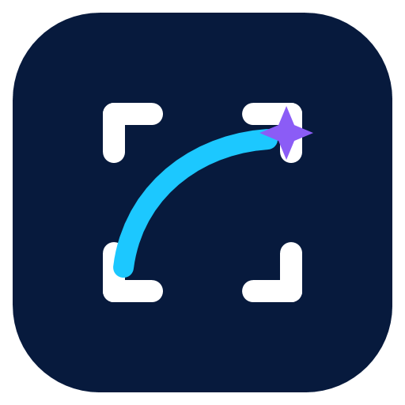

# SnipArc

Screenshot capture and annotation for Windows that keeps your screenshots on your machine.

[](https://github.com/77degrees/SnipArc/actions/workflows/ci.yml)
[](LICENSE)

<p align="center"></p>

Press a key, drag a box, mark it up, paste it. No account, no upload, no
gallery, no telemetry. Captures go to your clipboard or your disk and nowhere
else.

> **Status: `0.2.0-alpha`, Windows 11 x64.** Working and in daily use, but the
> installer is unsigned. See [limitations](#known-limitations).

## Install

Download `SnipArc-Setup-x64.exe` from [releases](https://github.com/77degrees/SnipArc/releases).

It installs per user under `%LocalAppData%\Programs\ScreenCaptureApp` and needs
no administrator rights. The folder and executable keep the old
`ScreenCaptureApp` name during the alpha so existing installs and settings
upgrade in place.

The alpha is not code-signed, so SmartScreen will warn about an unknown
publisher. Don't hand it to anyone as a trusted release until signing is set up.

## Use it

SnipArc lives in the notification area. Press **Print Screen** to capture.
`Ctrl+Shift+4` and `Ctrl+Shift+S` are alternatives if something else owns that
key, and a setting can take over `Win+Shift+S` from the Snipping Tool.

Once the overlay is up:

- **Hover a window and click** to grab it whole, or **drag** for a custom area
- Resize from eight handles, or nudge with arrows (`Shift` for ten pixels)
- Annotate with pen, line, arrow, rectangle, highlighter, text, pixelation, or
  opaque redaction
- Copy, save, extract text and barcodes, record a GIF, or start a scrolling capture
- **Esc** cancels

Live pixel dimensions, undo/redo, and per-tool keyboard shortcuts are shown in
the tooltips.

## What it does

**Capture** — physical-pixel GDI capture with mixed-DPI-aware overlay
positioning, optional pointer inclusion, and whole-window detection with hover
preview.

**Annotate** — the usual markup tools, plus two that are unusual: pixelation and
*opaque* redaction. Redaction is applied last during export and the app refuses
lossy formats when a capture contains it, so you cannot accidentally publish a
JPEG whose artifacts leak what you covered.

**Extract** — offline English OCR and multi-format barcode/QR recognition, both
fully local. Optional translation is the one feature that can reach the network,
and only when you press Translate.

**Beyond a single frame** — user-stepped scrolling capture with automatic
vertical-overlap removal, and animated GIF recording at 8 FPS for up to 15
seconds.

**Deployment** — a per-user Inno Setup installer, plus a buildable per-machine
MSI with ADMX/ADML policies for managed environments.

## Privacy

No accounts, no screenshot uploads, no analytics, no telemetry, no hidden
capture history.

One exception, off by default: if you configure a translation endpoint, pressing
Translate sends the **extracted text** — never image pixels — to the URL you
chose. The endpoint must be HTTPS, or plain HTTP only when it runs on your own
machine. Group Policy can disable it outright.

Self-host the translation backend so nothing leaves your network:
[deploy/libretranslate](deploy/libretranslate/README.md). Full data handling is
in [security and privacy](docs/security-and-privacy.md).

## Build from source

Needs Windows 11 x64, .NET SDK `10.0.302` (or whatever `global.json` selects),
and Inno Setup 6 only if you want the installer.

```powershell
dotnet restore ScreenCaptureApp.slnx
dotnet build ScreenCaptureApp.slnx -c Release --no-restore
dotnet test ScreenCaptureApp.slnx -c Release --no-build --no-restore
```

Everything packaged at once:

```powershell
.\eng\build-release.ps1 -BuildInstaller -BuildEnterpriseMsi -BuildBrowserExtension
```

| Output | What it is |
|---|---|
| `artifacts/app/win-x64/ScreenCaptureApp.exe` | Unpackaged self-contained app |
| `artifacts/installer/SnipArc-Setup-x64.exe` | Per-user installer |
| `artifacts/enterprise/SnipArc-Enterprise-x64.msi` | Per-machine enterprise installer |
| `artifacts/extension/SnipArc-Browser-Capture-0.2.0.zip` | Source-loadable Edge/Chrome extension |
| `artifacts/SHA256SUMS.txt` | Hashes for the artifacts above |

## Layout

| Path | Responsibility |
|---|---|
| `src/ScreenCaptureApp.Core` | Geometry, selection, annotations, editor commands, history |
| `src/ScreenCaptureApp.Windows` | Capture, displays, hotkeys, clipboard, settings, startup, single-instance IPC |
| `src/ScreenCaptureApp.App` | WPF tray app, overlay, toolbars, export workflow, settings UI |
| `tests/` | Core, Windows-infrastructure, and export-safety tests |
| `installer/` | Inno Setup definition |
| `packaging/enterprise/` | WiX MSI and Group Policy templates |
| `extensions/chromium/` | Edge/Chrome visible-tab capture extension |
| `deploy/libretranslate/` | Self-hosted translation backend |
| `eng/` | Release build script |
| `docs/` | Requirements, architecture, privacy, testing |

## Known limitations

- **Not code-signed.** SmartScreen will complain, and automatic updates stay off
  until a signing identity and release feed exist.
- **One monitor per capture.** Cross-monitor selection is planned; windows
  spanning monitors aren't offered for whole-window selection.
- **HDR, protected content, and exclusive-fullscreen** may not capture correctly
  with the GDI backend.
- **Scrolling capture is manual** — you scroll between page captures. Automatic
  scrolling isn't reliable enough across browsers and desktop frameworks yet.
- **The browser extension** loads from source only; it isn't in any store.
- **Windows only.** No macOS or Linux client.
- Mixed-DPI hardware testing remains a release gate.

## Code signing

[Free code signing provided by SignPath.io, certificate by SignPath
Foundation](docs/code-signing.md). Approval is pending, so this alpha is
explicitly unsigned.

- Committer and reviewer: [@77degrees](https://github.com/77degrees)
- Signing approver: [@77degrees](https://github.com/77degrees)
- Privacy: This program will not transfer any information to other networked
  systems unless specifically requested by the user or the person installing or
  operating it.

## Documentation

[Documentation index](docs/README.md) — or open `docs/index.html` in a browser
after running `docs/serve.cmd`.

[Requirements](docs/requirements.md) ·
[Architecture](docs/architecture.md) ·
[Security and privacy](docs/security-and-privacy.md) ·
[Testing](docs/testing.md) ·
[Code signing](docs/code-signing.md) ·
[Changelog](CHANGELOG.md)

## Contributing and license

MIT licensed. Read [CONTRIBUTING.md](CONTRIBUTING.md) before opening a pull
request, and report suspected vulnerabilities privately per
[SECURITY.md](SECURITY.md).
