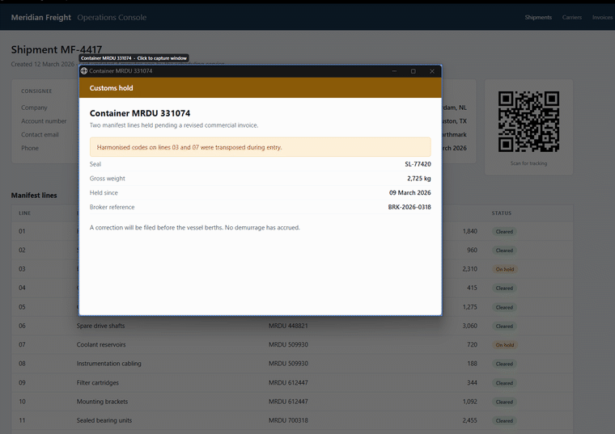
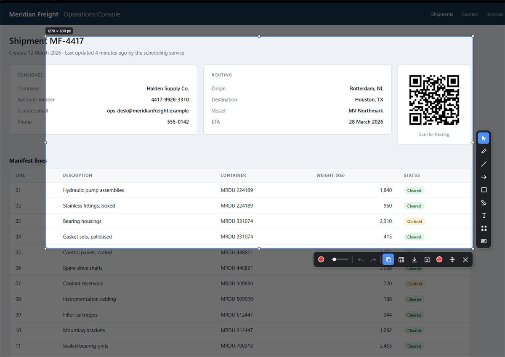
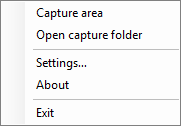
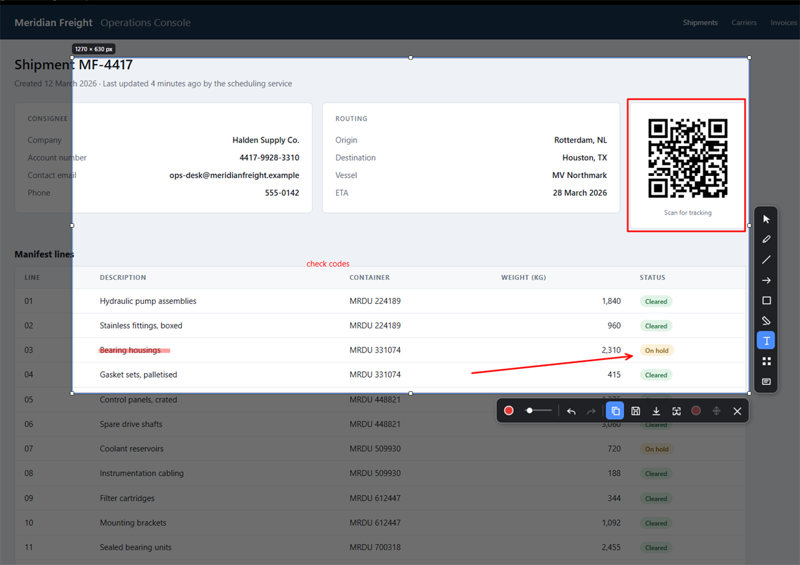
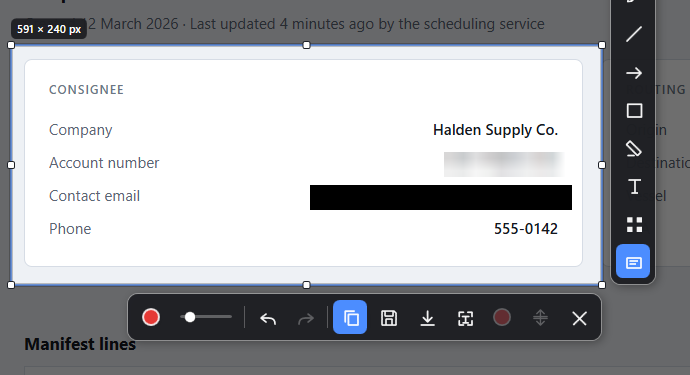
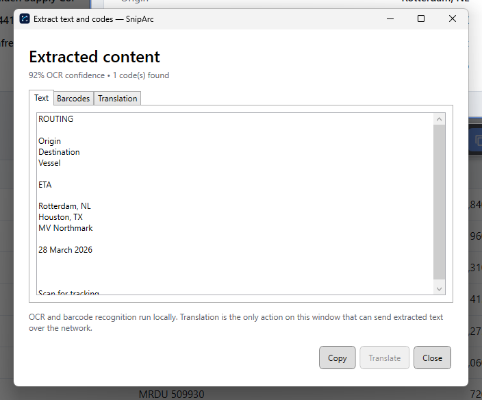
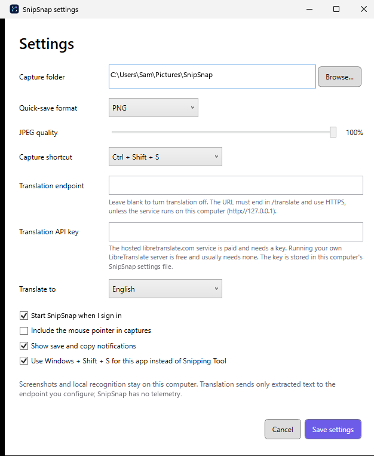

# SnipSnap

Screenshot capture and annotation for Windows that keeps your screenshots on your machine.

[](https://github.com/77degrees/SnipSnap/actions/workflows/ci.yml)
[](LICENSE)

<p align="center"></p>

Press a key, drag a box, mark it up, paste it. No account, no upload, no
gallery, no telemetry. Captures go to your clipboard or your disk and nowhere
else.

> **Status: `0.2.0-alpha`, Windows 11 x64.** Working and in daily use, but the
> installer is unsigned. See [limitations](#known-limitations).

<p align="center"></p>
<p align="center"><sub>Shortcut, drag, mark up, copy. The screen dims, any window can be taken whole, and the capture lands on the clipboard.</sub></p>

## Install

Download `SnipSnap-Setup-x64.exe` from [releases](https://github.com/77degrees/SnipSnap/releases).

It installs per user under `%LocalAppData%\Programs\SnipSnap` and needs no
administrator rights.

If you ran an earlier alpha under the SnipArc name, that install is separate and
is not upgraded in place. Uninstall it first, then copy
`%LocalAppData%\ScreenCaptureApp\settings.json` into `%LocalAppData%\SnipSnap\`
if you want to keep your settings.

The alpha is not code-signed, so SmartScreen will warn about an unknown
publisher. Don't hand it to anyone as a trusted release until signing is set up.

## Use it

SnipSnap lives in the notification area. Press **Print Screen** to capture.
`Ctrl+Shift+4` and `Ctrl+Shift+S` are alternatives if something else owns that
key, and a setting can take over `Win+Shift+S` from the Snipping Tool.

Once the overlay is up:

- **Hover a window and click** to grab it whole, or **drag** for a custom area
- Resize from eight handles, or nudge with arrows (`Shift` for ten pixels)
- Annotate with pen, line, arrow, rectangle, highlighter, text, pixelation, or
  opaque redaction
- Copy, save, extract text and barcodes, record a GIF, or start a scrolling capture
- **Esc** cancels

Live pixel dimensions, undo/redo, and per-tool keyboard shortcuts are shown in
the tooltips.

<p align="center"></p>
<p align="center"><sub>The selection carries eight handles and a live pixel size. Tools sit on the right, actions below.</sub></p>

Right-click the tray icon for the menu, or double-click it to capture without
touching the keyboard.

<p align="center"></p>

## What it does

**Capture** — physical-pixel GDI capture with mixed-DPI-aware overlay
positioning, optional pointer inclusion, and whole-window detection with hover
preview.

**Annotate** — the usual markup tools, plus two that are unusual: pixelation and
*opaque* redaction. Redaction is applied last during export and the app refuses
lossy formats when a capture contains it, so you cannot accidentally publish a
JPEG whose artifacts leak what you covered.

<p align="center"></p>
<p align="center"><sub>Pen, line, arrow, rectangle, highlighter and text. Each tool has a single-key shortcut.</sub></p>

The two obscuring tools are not the same thing, and the difference matters.
Pixelation scrambles pixels and can sometimes be reversed. Opaque redaction
paints solid colour over the region and destroys what was underneath.

<p align="center"></p>
<p align="center"><sub>Pixelated account number above, opaque redaction over the email below.</sub></p>

**Extract** — offline English OCR and multi-format barcode/QR recognition, both
fully local. Optional translation is the one feature that can reach the network,
and only when you press Translate.

<p align="center"></p>
<p align="center"><sub>OCR confidence and decoded codes, with the network boundary stated on the window itself.</sub></p>

**Beyond a single frame** — user-stepped scrolling capture with automatic
vertical-overlap removal, and animated GIF recording at 8 FPS for up to 15
seconds.

**Deployment** — a per-user Inno Setup installer, plus a buildable per-machine
MSI with ADMX/ADML policies for managed environments.

## Privacy

No accounts, no screenshot uploads, no analytics, no telemetry, no hidden
capture history.

One exception, off by default: if you configure a translation endpoint, pressing
Translate sends the **extracted text** — never image pixels — to the URL you
chose. The endpoint must be HTTPS, or plain HTTP only when it runs on your own
machine. Group Policy can disable it outright.

The translation endpoint ships empty, which is what turns translation off.

<p align="center"></p>

Self-host the translation backend so nothing leaves your network:
[deploy/libretranslate](deploy/libretranslate/README.md). Full data handling is
in [security and privacy](docs/security-and-privacy.md).

## Build from source

Needs Windows 11 x64, .NET SDK `10.0.302` (or whatever `global.json` selects),
and Inno Setup 6 only if you want the installer.

```powershell
dotnet restore SnipSnap.slnx
dotnet build SnipSnap.slnx -c Release --no-restore
dotnet test SnipSnap.slnx -c Release --no-build --no-restore
```

Everything packaged at once:

```powershell
.\eng\build-release.ps1 -BuildInstaller -BuildEnterpriseMsi -BuildBrowserExtension
```

| Output | What it is |
|---|---|
| `artifacts/app/win-x64/SnipSnap.exe` | Unpackaged self-contained app |
| `artifacts/installer/SnipSnap-Setup-x64.exe` | Per-user installer |
| `artifacts/enterprise/SnipSnap-Enterprise-x64.msi` | Per-machine enterprise installer |
| `artifacts/extension/SnipSnap-Browser-Capture-0.2.0.zip` | Source-loadable Edge/Chrome extension |
| `artifacts/SHA256SUMS.txt` | Hashes for the artifacts above |

## Layout

| Path | Responsibility |
|---|---|
| `src/SnipSnap.Core` | Geometry, selection, annotations, editor commands, history |
| `src/SnipSnap.Windows` | Capture, displays, hotkeys, clipboard, settings, startup, single-instance IPC |
| `src/SnipSnap.App` | WPF tray app, overlay, toolbars, export workflow, settings UI |
| `tests/` | Core, Windows-infrastructure, and export-safety tests |
| `installer/` | Inno Setup definition |
| `packaging/enterprise/` | WiX MSI and Group Policy templates |
| `extensions/chromium/` | Edge/Chrome visible-tab capture extension |
| `deploy/libretranslate/` | Self-hosted translation backend |
| `eng/` | Release build script |
| `docs/` | Requirements, architecture, privacy, testing |

## Known limitations

- **Not code-signed.** SmartScreen will complain, and automatic updates stay off
  until a signing identity and release feed exist.
- **One monitor per capture.** Cross-monitor selection is planned; windows
  spanning monitors aren't offered for whole-window selection.
- **HDR, protected content, and exclusive-fullscreen** may not capture correctly
  with the GDI backend.
- **Scrolling capture is manual** — you scroll between page captures. Automatic
  scrolling isn't reliable enough across browsers and desktop frameworks yet.
- **The browser extension** loads from source only; it isn't in any store.
- **Windows only.** No macOS or Linux client.
- Mixed-DPI hardware testing remains a release gate.

## Code signing

[Free code signing provided by SignPath.io, certificate by SignPath
Foundation](docs/code-signing.md). Approval is pending, so this alpha is
explicitly unsigned.

- Committer and reviewer: [@77degrees](https://github.com/77degrees)
- Signing approver: [@77degrees](https://github.com/77degrees)
- Privacy: This program will not transfer any information to other networked
  systems unless specifically requested by the user or the person installing or
  operating it.

## Documentation

[Documentation index](docs/README.md) — or open `docs/index.html` in a browser
after running `docs/serve.cmd`.

[Requirements](docs/requirements.md) ·
[Architecture](docs/architecture.md) ·
[Security and privacy](docs/security-and-privacy.md) ·
[Testing](docs/testing.md) ·
[Code signing](docs/code-signing.md) ·
[Changelog](CHANGELOG.md)

## Contributing and license

MIT licensed. Read [CONTRIBUTING.md](CONTRIBUTING.md) before opening a pull
request, and report suspected vulnerabilities privately per
[SECURITY.md](SECURITY.md).
